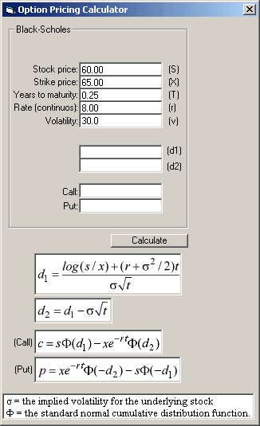



## Black\-Scholes \(1973\) Option Pricing Formula

### Description

Calculates Call & Put values using the Black-Scholes option pricing formula.
 
### More Info
 
The price of the underlying stock (S), the strike price (x), the continuously compounded risk free interest rate (r), the time in years until the expiration of the option (t), the implied volatility for the underlying stock (v), the standard normal cumulative distribution function (CND).

             |
---                |---
**Submitted On**   |2003-03-25 16:33:26
**By**             |[Charles Toepfer](https://github.com/Planet-Source-Code/PSCIndex/blob/master/ByAuthor/charles-toepfer.md)
**Level**          |Intermediate
**User Rating**    |5.0 (15 globes from 3 users)
**Compatibility**  |VB 6\.0, VB Script
**Category**       |[Math/ Dates](https://github.com/Planet-Source-Code/PSCIndex/blob/master/ByCategory/math-dates__1-37.md)
**World**          |[Visual Basic](https://github.com/Planet-Source-Code/PSCIndex/blob/master/ByWorld/visual-basic.md)
**Archive File**   |[Black\-Scho1564583252003\.zip](https://github.com/Planet-Source-Code/charles-toepfer-black-scholes-1973-option-pricing-formula__1-44259/archive/master.zip)

